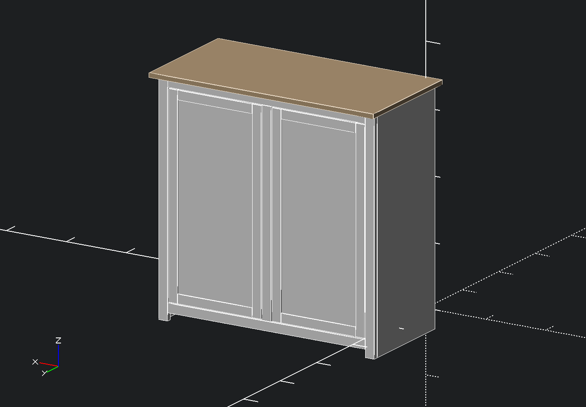
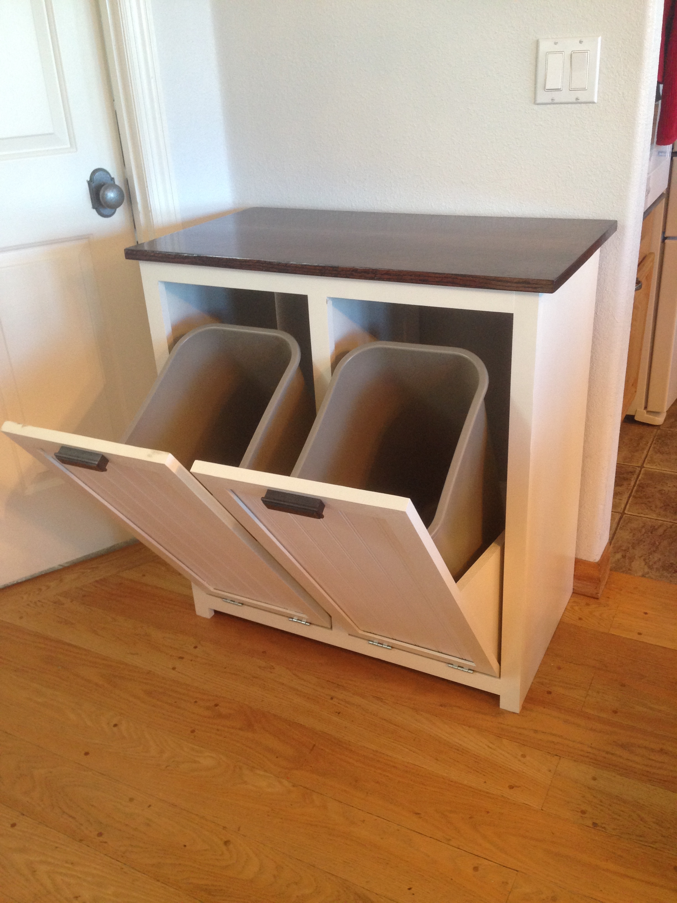

Garbage Cabinet
===============
A script to generate plans for a tilt-out garbage cabinet.  Adjust any measurements at the top of the script, and when you build the model, a cut list will be output in the console.

The script will not build the cabinet for you, but it makes it easier.

